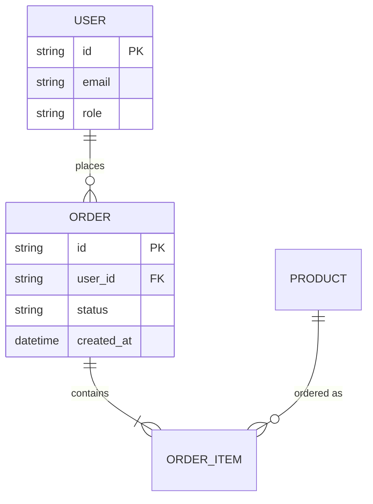
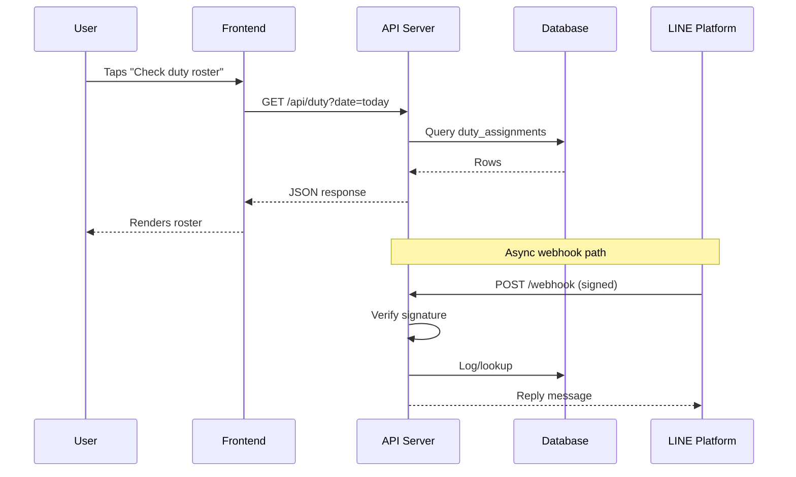

# Implementation Planning, Schema Design & Sequence Diagrams

Use this before writing code on anything nontrivial (a new feature touching more than ~1 file, a new API, a schema change, an integration with an external service). Planning first is what separates production-grade work from ad-hoc code — it surfaces design problems while they're still cheap to fix, and gives the user a checkpoint to redirect before a lot of code exists.

Skip this for genuinely small, single-file, low-risk changes — a plan for a one-line fix is its own anti-pattern (see Token efficiency in the main SKILL.md).

## 1. Implementation Plan

A good plan is decision-focused, not a restatement of the request. Structure:

```
## Goal
<one or two sentences: what this achieves, for whom>

## Scope / Out of scope
- In scope: <explicit list>
- Out of scope: <explicit list — just as important, prevents scope creep and sets expectations>

## Approach
<the chosen approach, and *why this one* if there were real alternatives — 
1-3 sentences per alternative considered and rejected, not an essay>

## Changes by area
- **Database/schema**: <what changes, see §2>
- **Backend/API**: <new/changed endpoints, services>
- **Frontend**: <new/changed components, pages, state>
- **Integrations**: <external services touched, webhooks, auth>

## Sequencing
<ordered steps — see below for how to decide order>

## Risks & open questions
- <anything uncertain, anything that needs a decision from the user before proceeding>

## Rollback / safety
<how to undo this if it goes wrong in prod — feature flag, migration reversibility, etc.>
```

**Sequencing principles:**
- Schema/data-layer changes first (everything else depends on the shape of the data).
- Backend before frontend when frontend depends on new API shape — but build a stub/mock endpoint early if frontend work can start in parallel.
- Land changes in small, independently-deployable increments where possible rather than one giant PR — each increment should leave the app in a working state.
- Anything backward-incompatible (schema change, API contract change) gets an explicit migration step, not "just deploy it."

**Calibrate plan depth to task size.** A plan for a CRUD feature is a few bullets. A plan for a new auth system or a payment integration earns the full structure above, including risks and rollback. Don't apply enterprise-weight planning ceremony to a small feature — see the layering-weight guidance in `production-architecture.md`.

## 2. Schema Design

When designing or changing a data schema (SQL, NoSQL, or a lightweight store like Google Sheets used as a datastore):

- **Model entities and relationships first**, independent of storage technology — what are the things, how do they relate (1:1, 1:many, many:many), before deciding tables/collections/sheets.
- **Normalize until it hurts, then denormalize deliberately.** Start normalized (no duplicated data); only denormalize for a specific, measured performance need, and document why.
- **Every foreign key relationship** should be enforced at the DB level where the technology supports it (FK constraints), not just assumed in application code.
- **Index anything filtered, sorted, or joined on** in a hot-path query — call this out explicitly in the plan, don't leave it implicit.
- **Nullable vs required**: every column/field should have a deliberate answer to "can this be empty," not a default of nullable-because-easier.
- **Soft-delete vs hard-delete**: decide explicitly per entity (audit/compliance needs vs storage growth) rather than defaulting to one without thinking about it.
- **Migrations**: write the migration as part of the plan, not as an afterthought — include both the "up" change and how it stays backward-compatible during a rolling deploy (see `production-architecture.md` §7).
- **For lightweight/non-SQL backends** (e.g. Google Sheets as a datastore): still write out the schema explicitly (columns, types, what's derived vs stored, which sheet is source of truth for what) — the lack of enforced structure makes this documentation more important, not less.

### Representing a schema

Use a Mermaid ER diagram when a visual would help the user (multi-entity schemas, review of an existing schema, before/after of a migration). Keep it to the entities relevant to the current task, not the whole database, unless the whole database *is* the task.



For a text-only context (e.g. inline in a review comment), a compact field list per entity is fine — reserve the diagram for when relationships between 3+ entities need to be seen at once.

## 3. Sequence Diagrams

Use a sequence diagram whenever a flow involves more than 2 parties/systems interacting over time, or has async/callback steps that are easy to get wrong in prose — auth flows (OAuth redirect, magic link), webhook handling, multi-step checkout, anything involving a queue/background job, LINE/chat-bot request-reply flows.

Don't use one for a simple synchronous request/response between 2 parties — that's better as one sentence.



**When drafting a sequence diagram as part of planning (before code exists):** use it to find problems — where can this fail partway through? What happens if step 3 times out — does step 2's effect get rolled back, or is the system left in a half-done state? Call out the answer as an explicit step or a note in the diagram, not left implicit. This is often where the real design decisions in a plan actually get made.

**When drafting one for an existing system (review/documentation):** derive it from the actual code path, not from what the code is "supposed to" do — trace real function/handler calls.

## Output format

For a build task: present the plan in prose/mermaid inline in chat for the user to review and approve *before* writing implementation code, unless the task is small enough that planning inline as you go is proportionate. Don't silently start writing a large amount of code on a nontrivial, ambiguous, or high-risk change without checkpointing the plan with the user first — a wrong plan caught early costs a paragraph; a wrong plan caught after code exists costs a rewrite.
